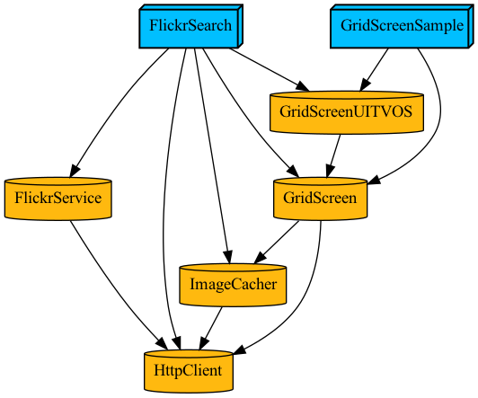
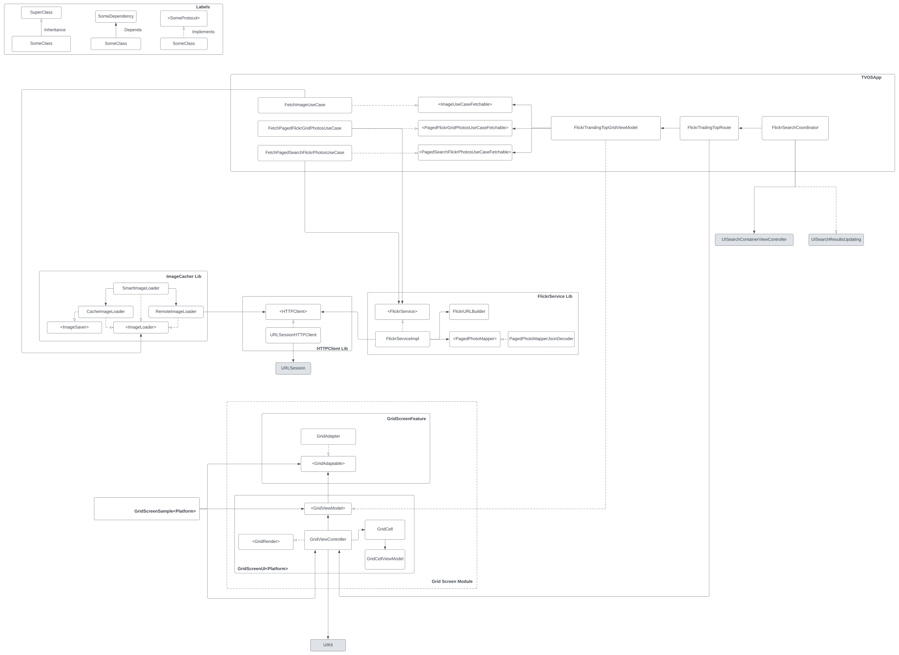

# FlickrSearchApp

[](http://www.youtube.com/watch?v=PdcHfc2g3K0 "FlickrDemo")

## Content:

Make an TVOS app with Swift/UIKit that the user can see an grid of popular photos from Flickr with infinite scrolling and search.

## Important:

The api_key from Flickr on this project are deleted, you need to generate a new own and put on [FlickrURLBuilder/apiKey](https://github.com/lucasmpaim/flickr-app/blob/main/Targets/FlickrService/Sources/FlickrURLBuilder.swift#L25)

## Useful commands:

- Create XCode Project

```bash
./.tuist-bin/tuist generate
```

or just

```bash
make project
```

## Architecture




Witch this architecture features are decopladed, so the grid screen itself don't knows who is populating the information, just sent the events.


## Improvements

One improvement to make on this project is create a Service Locator to register cross-modules dependencies to make router's less repetitive and improve dependency management, like https://github.com/Swinject/Swinject library:


```swift
final class FlickrTradingTopRoute { 
	@Inject var service: FlickrService
	@Inject var imageLoader: ImageLoader

	static func makeViewController() -> UIViewController { 
        let adapter = GridAdapter<GridCellViewModel>()
        
        let grid = GridViewController(
            viewModel: FlickrTrandingTopGridViewModel(
                adapter: adapter,
                fetchPagedGridUseCase: FetchPagedFlickrGridPhotosUseCase(service: service),
                imageUseCaseFetchable: FetchImageUseCase(
                    imageLoader: imageLoader
                ),
                searchPagedGridUseCase: FetchPagedSearchFlickrPhotosUseCase(
                    service: service
                )
            )
        )
        grid.title = "Feed"
        return grid
	}
} 
```

And register the correct implementation on the app startup

```swift
@main
class AppDelegate: UIResponder, UIApplicationDelegate {
	//....
	func registerDependencies() { 
		Container.shared.register({ solve in FlickrServiceImpl(service: solve()) }, for: FlickrService.self)
		///...
	}
}
```


Another thing that can be improved is split the libraries in Two different target's (<Lib>Interface and <Lib>) on Interface will just have protocols and another public stuff that any module can use without comprimise the decoupling. On the other module is the default implementation that can be replaced on future only changing the glue-layer (aka: AppDelegate).
